<div align="center">


# Fynliq — Beta

**Know what your aid actually leaves you.**

The Fynliq beta: a landing page that makes the argument, and the flow behind it
where a student uploads their own aid summary and gets their own answer back —
what they keep, what they repay, what nothing is covering, what their school is
actually asking for, and what to do next.

[](https://fynliq-landing-nine.vercel.app)
[](https://react.dev)
[](https://www.typescriptlang.org)
[](https://vite.dev)
[](#testing)

**[View the live site →](https://fynliq-landing-nine.vercel.app)**

</div>

<br />

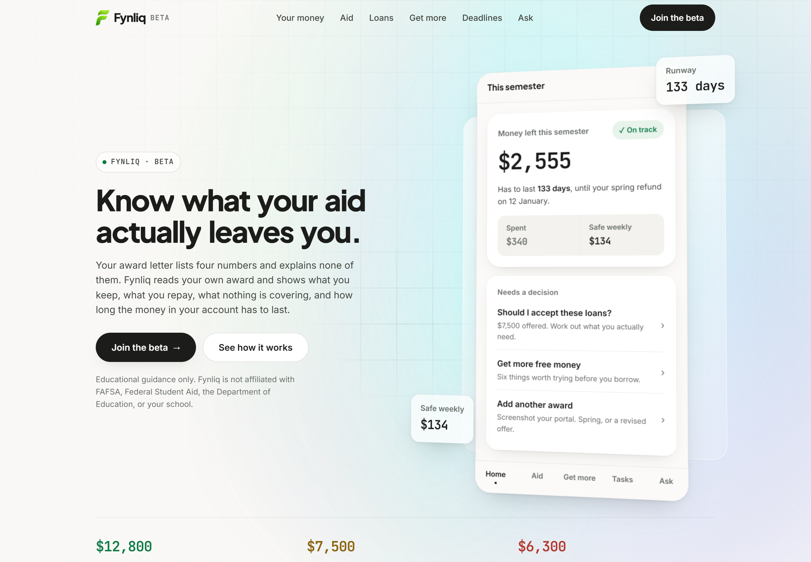

<br />

## Contents

- [What this is](#what-this-is)
- [Inside the page](#inside-the-page)
- [The account](#the-account)
- [The beta flow](#the-beta-flow)
- [The three tabs](#the-three-tabs)
- [How the ranking works](#how-the-ranking-works)
- [Earn with Gradi](#earn-with-gradi)
- [Connecting the backend](#connecting-the-backend)
- [Quick start](#quick-start)
- [Stack](#stack)
- [Architecture: three rules](#architecture-three-rules)
- [Design system](#design-system)
- [Motion and state](#motion-and-state)
- [Accessibility](#accessibility)
- [Data and disclaimers](#data-and-disclaimers)
- [Testing](#testing)
- [Deployment](#deployment)

<br />

## What this is

An award letter gives a student four rows and a total, and explains none of them.
This landing page is the argument for a product that does explain them — built to
the Fynliq Beta Design Handoff and speaking the same product language as the beta
prototype.

Every dollar figure on the page is computed by the same tested pure functions the
app would use, rendered from one demo student. The page is a live preview of the
product's reasoning, not a mockup of it.

<br />

## Inside the page

**Money clarity** — the runway, the weekly safe-to-spend, and the honest empty
state when there is no disbursement date to compute from.

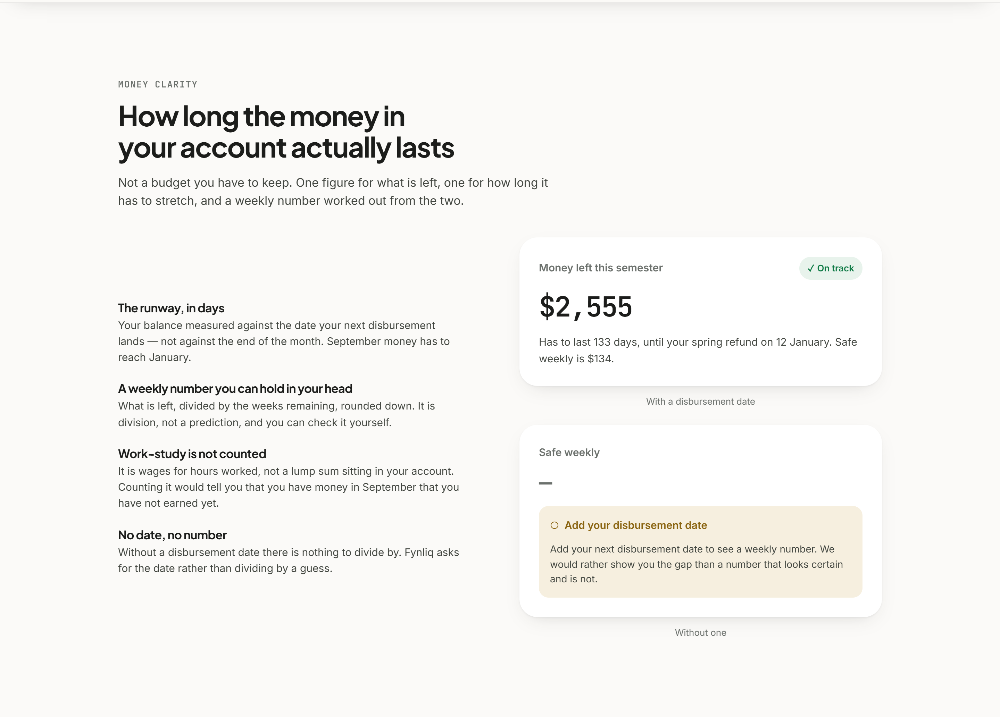

**Financial aid** — the award split line by line into money kept and money
repaid, with a glossary for the words the letter never defines.

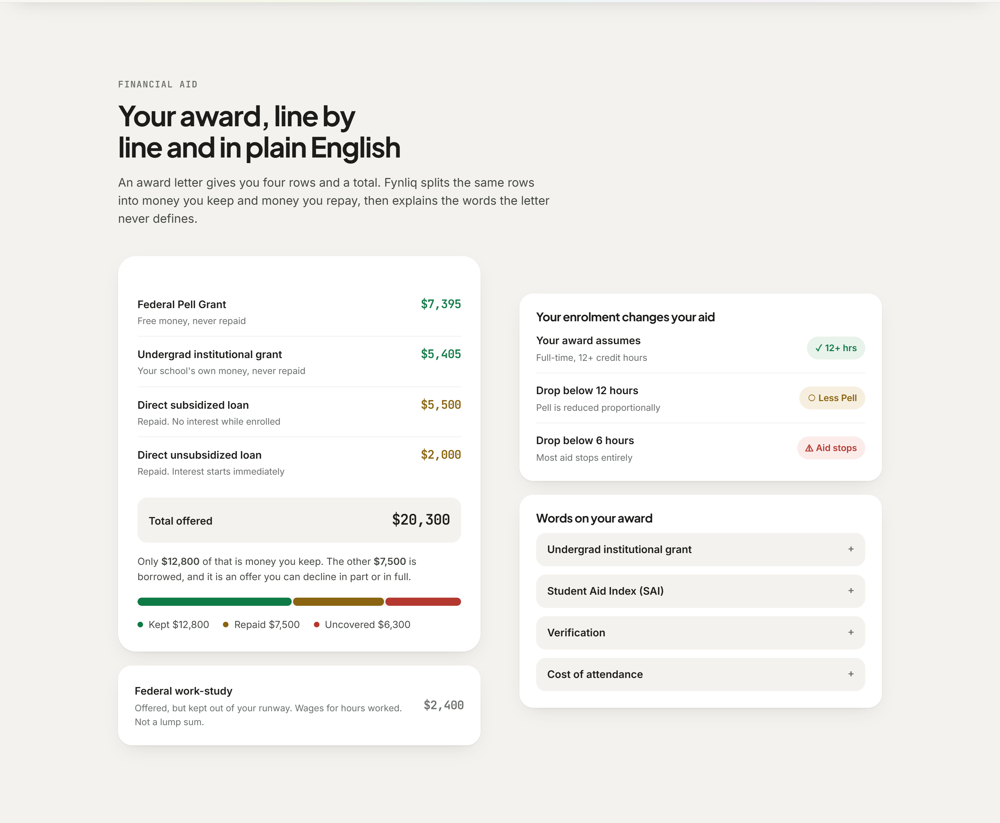

**Loan decision** — a slider where the verdict moves green → gold → rust as the
student steps past what they actually owe. The colour *is* the advice.

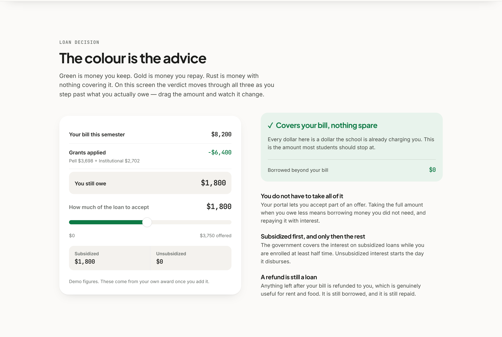

**Get more** — categories and the questions worth asking before borrowing, not
invented scholarships with made-up deadlines.

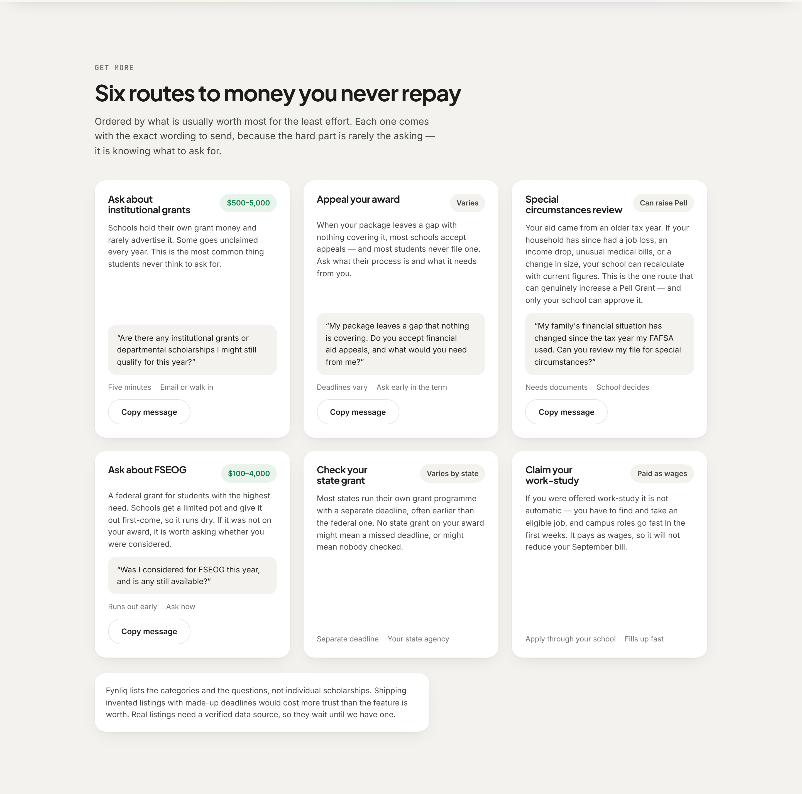

**Deadlines** — the tasks that actually move money, ordered by what happens if
they are missed.

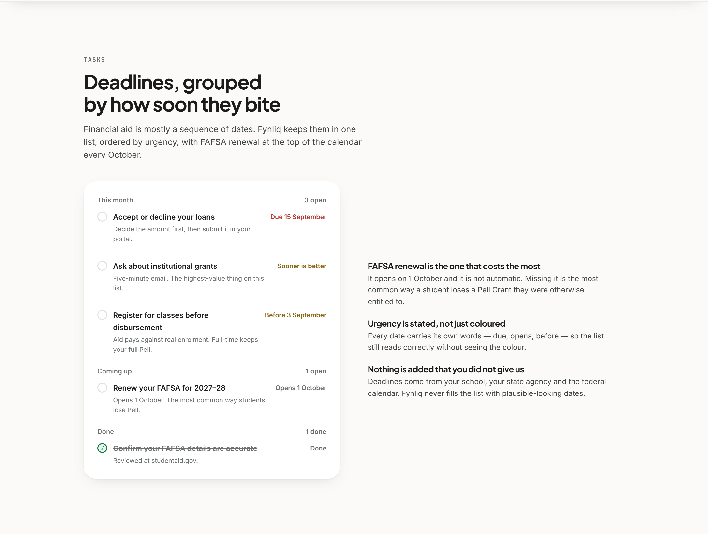

**Ask** — plain-English answers to the questions students bring to a financial
aid office.

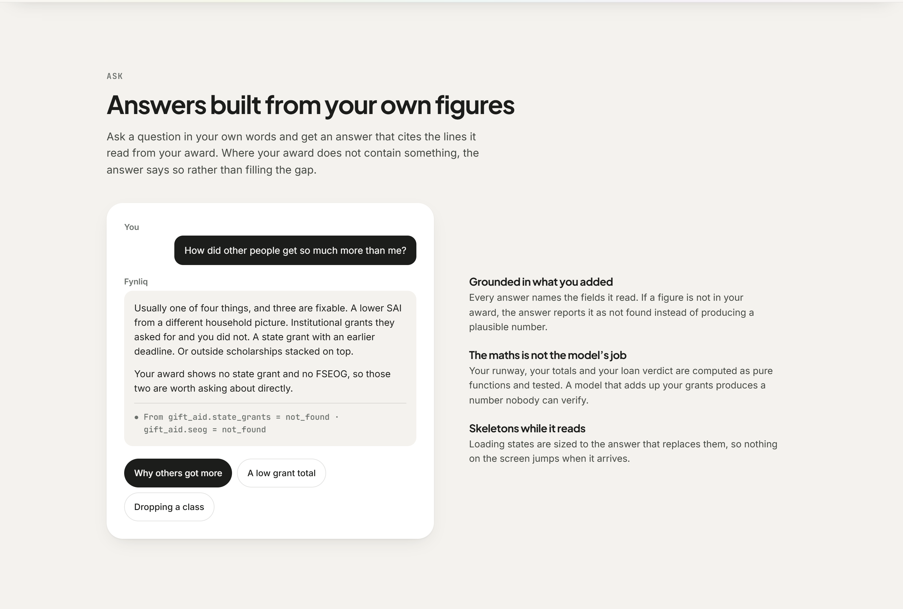

### Mobile

<div align="center">
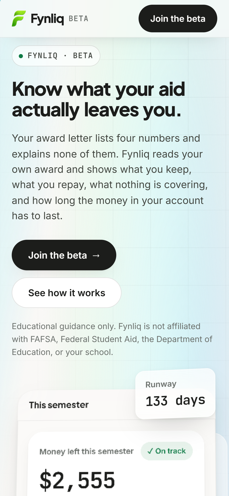
</div>

<br />

## The account

Everything a student does with their own money is behind one log-in.

```
/            Join the beta  ──►  /login   ──►  /signup
                                    │             │
                                    └──────┬──────┘
                                           ▼
                                  /beta   the upload page
                                  /search and the other two tabs
                                  /ask
```

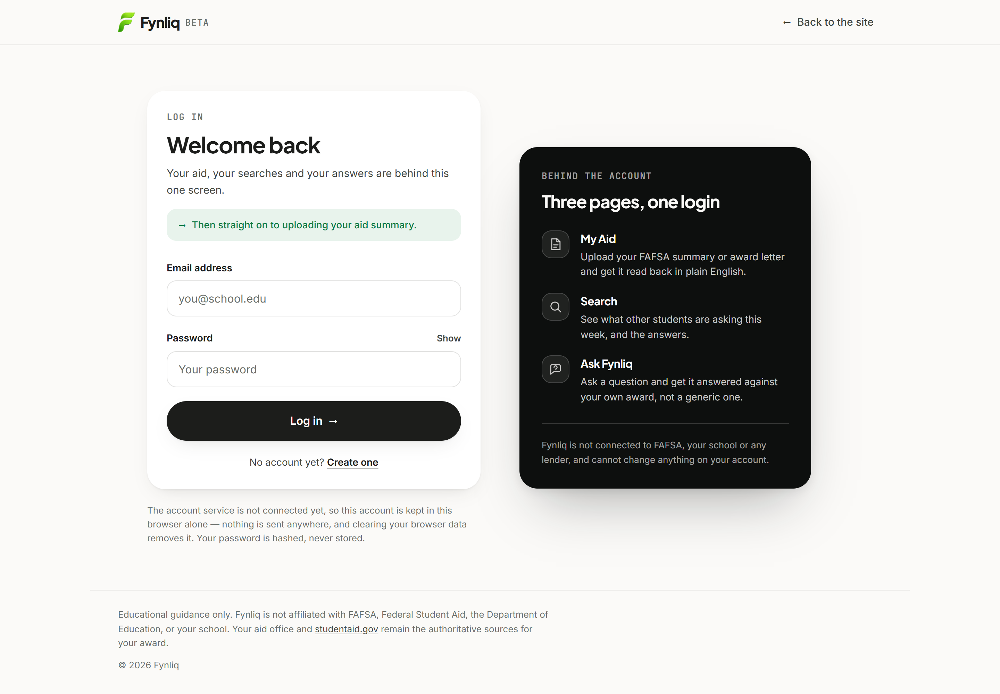

**Pressing Join the beta anywhere on the site now lands on `/login`.** Not the
upload page, and not a modal over it — the gate is on the route, so every
entrance leads through the same door and there is no path in that forgets to
check. Signing up lands straight on the upload page, with Search and Ask
Fynliq open behind it.

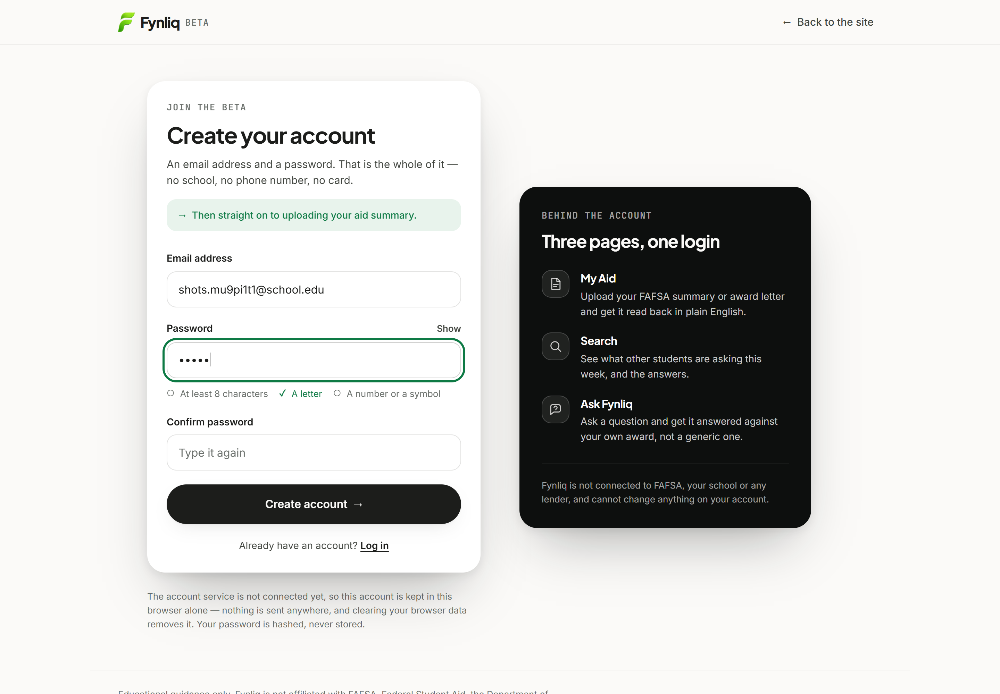

An email address and a password. No school, no phone number, no card, and no
"tell us about yourself" step between a student and the thing they came for.

The password rules are stated before they are typed against, and tick as they
are met, rather than being sprung on submit. A refused log-in says *"that
email and password do not match an account"* whichever half was wrong, because
naming the half tells a stranger which addresses have signed up.

**What is gated, and what is not.** `/beta`, `/search` and `/ask` are behind
the account; the landing page and the Gradi page stay public, because they are
how somebody decides whether to sign up at all. The whole rule is one array in
`src/App.tsx` — moving a page either way is a line, not a refactor.

**Logging out empties the tab.** The analysis is held in memory and nowhere
else, and it goes when the session does. A shared library laptop does not show
the last student's award to the next one.

Until the account service is connected, accounts live in the browser —
PBKDF2-SHA-256 over a per-account salt, compared in constant time, passwords
never stored — and the log-in page says so on screen rather than implying a
server that is not there. **[The full contract →](docs/AUTH_API.md)**

<br />

## The beta flow

Every **Join the beta** button leads to `/beta`, where a student uploads their
own documents and gets their own answer back — by way of [the
account](#the-account), which is where a student without one lands first.

```
/            Join the beta  →  /login  →  /signup
/beta        Upload aid summary  →  Fynliq reads it
/beta/results                       Personalised answer and next steps
```

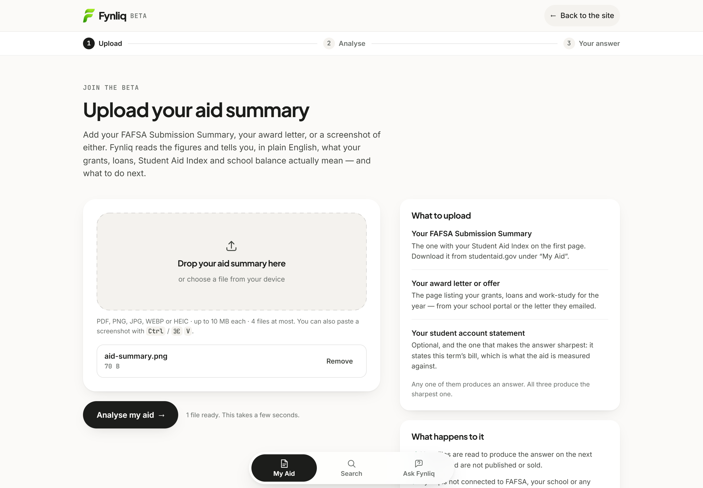

**Upload** (`/beta`) takes a FAFSA Submission Summary, an award letter, a
student account statement, or a screenshot of any of them — dropped, chosen,
or pasted straight from the clipboard with <kbd>Ctrl</kbd>/<kbd>⌘</kbd> +
<kbd>V</kbd>, which is the fastest thing a student can produce from a portal.
Up to four files, since award documents run to several pages. Every refusal is
announced in words with the fix in it; a dropzone that silently swallows a file
is the most common way this kind of interface wastes somebody's afternoon.

**Analysing** walks four named stages — reading, finding the award lines,
checking them against the bill, writing the answer — with skeletons shaped like
the answer that replaces them, and a cancel button that actually aborts the
request.

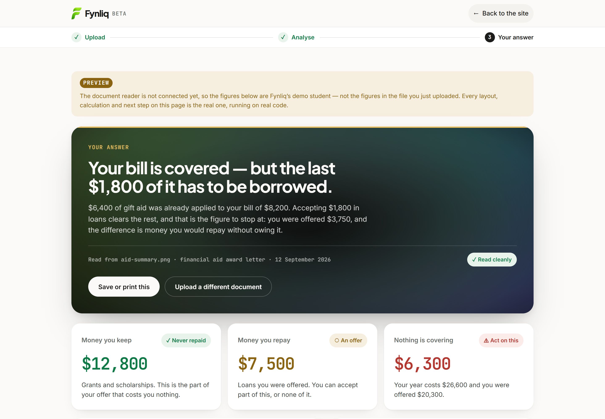

**The answer** (`/beta/results`) opens with the conclusion, not with a
dashboard:

> **Your bill is covered — but the last $1,800 of it has to be borrowed.**
> $6,400 of gift aid was already applied to your bill of $8,200. Accepting
> $1,800 in loans clears the rest, and that is the figure to stop at.

Then what supports it: money kept, money repaid and the uncovered gap; the
award line by line; what the school is actually asking for this term and the
exact amount to accept; the Student Aid Index in plain English; **what Fynliq
could not read**, listed rather than guessed at; a glossary of the words on
their own document; and the next steps, ordered by what it costs to skip them.

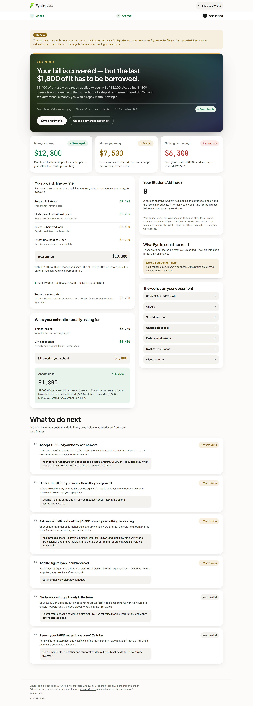

The result is held in memory and nowhere else — not in `sessionStorage`, not in
the URL. Reloading `/beta/results` returns to the upload step rather than
restoring somebody's financial position from disk. It prints cleanly, because a
student who gets a straight answer usually needs to take it to somebody.

### On a phone

<div align="center">
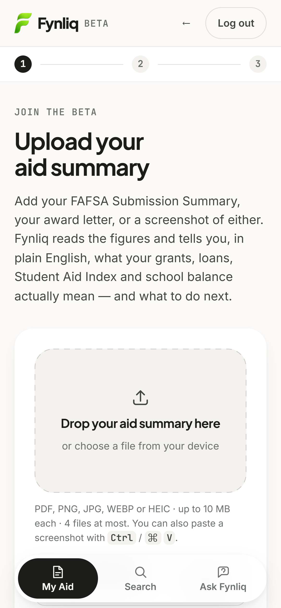
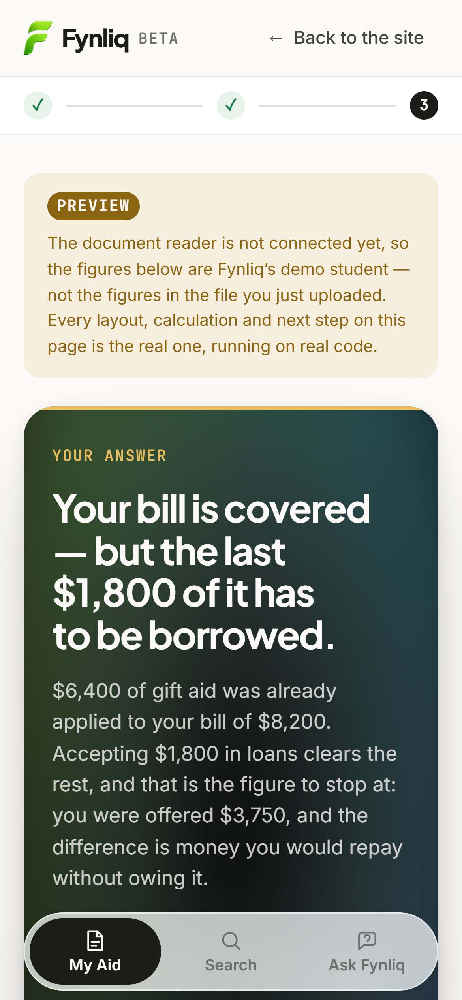
</div>

<br />

## The three tabs

Bottom navigation across three pages, each leading into the next: **My Aid**,
**Search**, **Ask Fynliq**. It is fixed at every width — a student who learns
where the tabs are on their phone finds them in the same place on a laptop —
and floats as a centred pill on desktop rather than stretching edge to edge.

```
/beta  /beta/results   My Aid        Upload a document, get your own answer
/search                Search        What every student is asking, ranked
/search/<question>                   One question, answered in full
/ask                   Ask Fynliq    The same question, about your own money
```

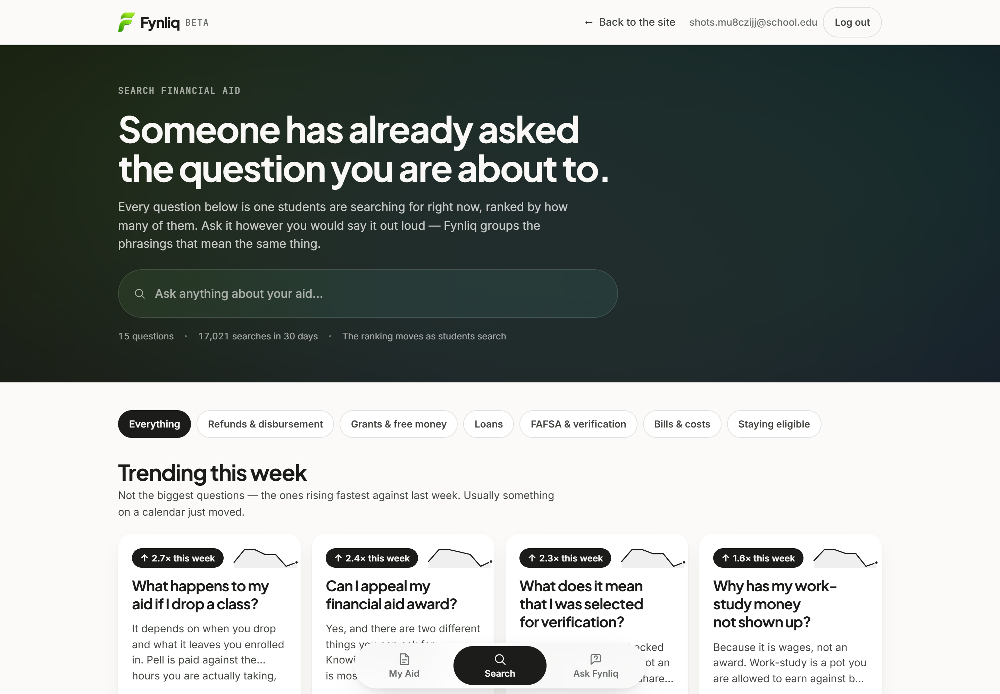

**Search** (`/search`) opens on what other students are searching for right
now. A large search field on the ink band, categories to filter by, then two
lists that are deliberately different lists:

**Trending this week** is what *moved* — the questions rising fastest against
last week, each with a seven-day sparkline and how steep the rise was. Usually
something on a calendar just shifted: verification in September, the drop
deadline a fortnight later.

**Most searched** is what is *settled* — ranked by 30-day volume, with a bar
on each row so the shape of student worry is visible and not just its order.
The question at the top is searched four times as often as the one in fourth,
and a numbered list alone would never say so.

Under every question is the social proof the brief asked for — `842 searches
in the past 30 days` — and the line that makes the grouping visible:
*Grouped from 5 ways students ask it*.

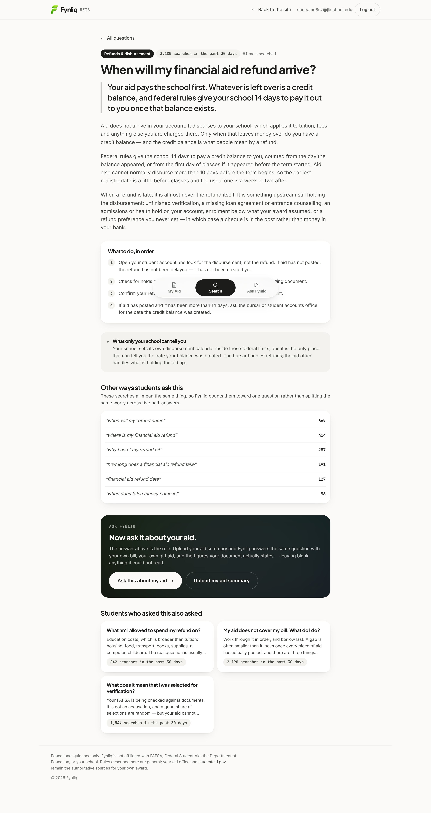

**An answer** (`/search/<question>`) opens with the conclusion, then the
reasoning, then what to do in order. It ends on **what only your school can
tell you**, because everything above it is a general rule and a general rule
stated without that line reads like a promise about somebody's particular
money.

Underneath: **the phrasings this question absorbed**, with their own counts —
the grouping proving itself rather than asking to be trusted — then a path to
Ask Fynliq, then related questions.

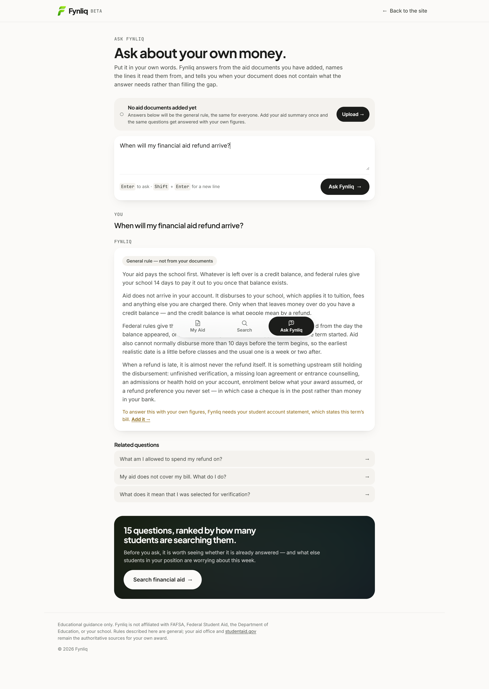

**Ask Fynliq** (`/ask`) is the same question asked about your own money. Every
answer is labelled `personal` or `general`: personal means it was computed from
figures on your own document and it names the fields it read them from;
general means it is the rule, and it says what you would need to add to make
it personal. There is no third state where an answer sounds personal and is
not — [the contract](docs/ASK_API.md) refuses to let the backend invent one.

### On a phone

<div align="center">
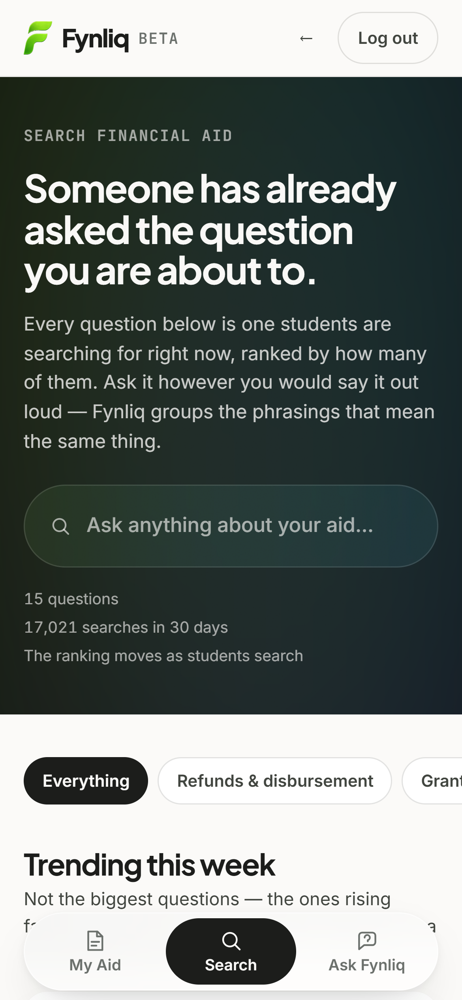
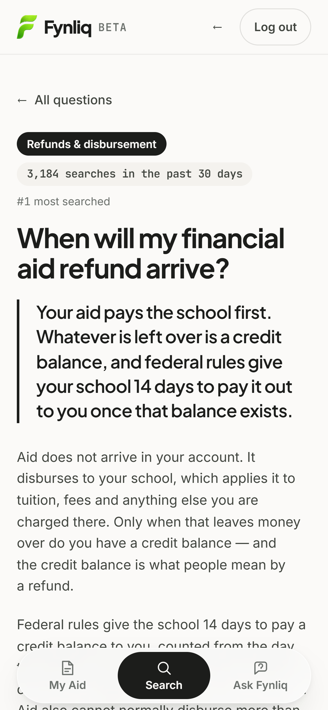
</div>

<br />

## How the ranking works

Nothing on the search page is ordered by hand. There is no editorial position
anywhere in it, and no number typed into a component. Every rank, movement
arrow, trend badge and bar length is computed in `src/core/trending.ts` from
counts that arrive through the analytics seam — which is why the ranking can
change daily without anybody editing a file, and why searching on the page
moves a question up while you watch.

```ts
rankQuestions(demand)      // → rank, previousRank, movement, momentum
selectTrending(demand)     // → what is rising, floored so noise cannot trend
previousWindow(demand)     // → the 30-day window, slid back one week
momentum(demand)           // → this week over last, or null when there is no baseline
volumeShare(searches, top) // → the length of the bar on each row
addSearch(demand, id)      // → one more search, counted immediately
```

**Most searched rises automatically.** Sort by 30-day volume, tie-break by id
so equal volumes never shuffle between renders. Hand it larger numbers and the
list reorders itself.

**Similar searches count as one question.** "When will my refund come", "Where
is my financial aid refund" and "Why hasn't my refund hit" all contribute to
*When will my financial aid refund arrive?*. The backend clusters historical
queries; `src/search/match.ts` does the same job live for the query being
typed, so somebody phrasing it their own way still lands on the canonical
answer — and is told which phrasing matched, rather than being silently
redirected.

**Trending is a different question from most-searched**, and is allowed to
disagree with it. It is measured on this week against last week, with a floor:
a question needs at least 40 searches in the week before it can appear,
however steep its rise. Three people and a typo can double a count of two.

**Position changes need no history table.** `previousRank` slides the 30-day
window back one week and ranks on that, so it moves for exactly the same
reason the visible ranking moves.

**New demand is called new, not infinite.** A question with no searches last
week has no ratio to report, so `momentum` returns `null` and the badge says
"New this week" rather than dividing by zero and printing a number.

Sample figures ship in `src/search/sampleAnalytics.ts` and the page **says on
screen that they are sample figures**, the same way the results page says when
it is showing the demo student. They obey every rule the real backend has to
obey — the same validator runs over both.

**[The full analytics contract →](docs/SEARCH_ANALYTICS_API.md)**

<br />

## Earn with Gradi

`/gradi` — a route to money that is not borrowed, which is the argument the
rest of the product makes about aid, made about income instead. Students can
become creators on Gradi, a food discovery app, and the page carries the $10
sign-up offer.

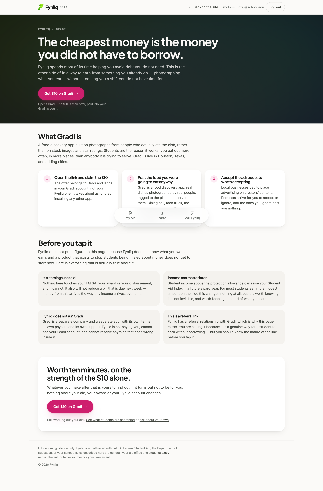

There is **no earnings figure anywhere on it**. Fynliq does not know what a
student would earn, and a product that exists to stop students being misled
about money does not get to guess. What the page does say, in the body rather
than in small print: this is a referral link, Gradi is a separate company
Fynliq cannot support or pay out on, none of it touches your FAFSA or your
award — and student income above the protection allowance can affect a future
Student Aid Index, which is worth knowing before you start.

The one coloured fill in the whole product lives here. `--partner-gradi` is a
third party's colour on a third party's offer, declared in `tokens.css` as a
partner brand value, used on this page and nowhere else, and deliberately
outside the green / gold / rust vocabulary so it cannot be read as saying
anything about money.

<br />

### The walkthrough

`/gradi/start` — the same offer, for a student who has already agreed with the
argument and is now trying to actually do it. `/gradi` is the case; this is the
checklist.

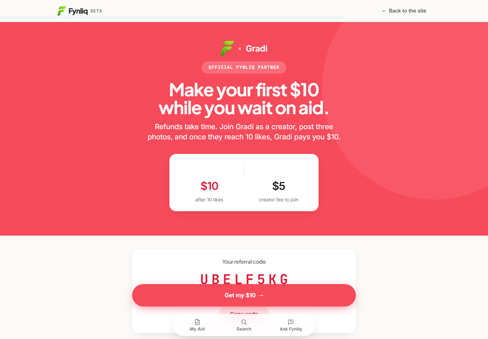

Six steps, in somebody else's app, and the student is switching between two
apps and losing their place. So the page **remembers which steps are ticked**,
in `localStorage`, per browser, sent nowhere. The stored value is read back
defensively: an index pointing past the end of a shortened list is dropped
rather than trusted, because a checklist that throws on a stale key would take
the whole page with it, and the page is the only route to the money.

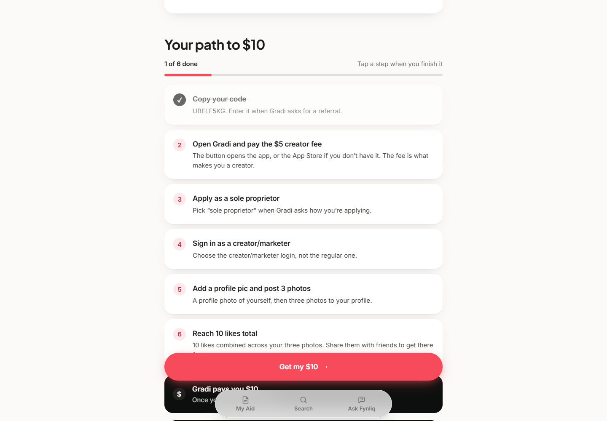

**The $5 appears wherever the $10 does** — in the hero, in step two, in the
questions and in the terms — and the terms say plainly that the $5 is gone
whether or not the likes ever arrive. A page that leads with a payout and
buries the fee is the kind of page this product exists to argue against.

There is still **no earnings figure**. The $10 is a fixed sum on a referral
link, not a guess at what a creator makes, and nothing turns it into a rate.

The referral relationship is answered under *Does Fynliq get anything?*, in the
student's own words rather than in small print. Both calls to action carry
`rel="sponsored"`, and `docs/gradi-screenshots.js` fails the build if either
one stops doing so.

The link, the code and both figures live in `src/gradi/offer.ts` — one place,
so the two Gradi pages can never point at different offers. **Confirm
`GRADI_CODE` against what Gradi actually issued before launch:** a code invented
here is a code Gradi has never heard of, and the student would enter it, be
credited nothing, and have no way of knowing why.

<br />

## Connecting the backend

The flow is finished and runs today against a local stub. Connecting the real
reader is one environment variable:

```bash
VITE_FYNLIQ_ANALYZE_URL=https://api.fynliq.com/v1/analyze
```

Unset, `src/beta/stubAnalyzer.ts` serves the demo student — and the results page
says so, in a banner, at the top. A stub that dressed placeholder figures up as
somebody's real aid would be the worst thing this product could ship, so
`provenance: 'demo'` is part of the type and the banner is not optional.

Set, the flow POSTs the files as `multipart/form-data` and validates the JSON
that comes back before anything downstream sees it. A backend still under
construction fails loudly at the boundary with the offending path named
(`award.lines[2].amount: expected a finite number`) rather than quietly
rendering `$NaN` to somebody deciding how much to borrow.

**[The full request and response contract →](docs/ANALYSIS_API.md)** — with a
worked example, the error semantics, and the three rules the frontend enforces.
No frontend changes are needed to connect it.

### The other three seams

Accounts, Search and Ask are built the same way, and are independent of each
other and of the reader — connect one, or all four.

```bash
VITE_FYNLIQ_AUTH_URL=https://api.fynliq.com/v1/auth       # docs/AUTH_API.md
VITE_FYNLIQ_SEARCH_URL=https://api.fynliq.com/v1/search   # docs/SEARCH_ANALYTICS_API.md
VITE_FYNLIQ_ASK_URL=https://api.fynliq.com/v1/ask         # docs/ASK_API.md
```

| | Unset | Set |
|---|---|---|
| **Accounts** | Accounts live in the browser, hashed with PBKDF2, and the log-in page says so | `POST {url}/signup`, `POST {url}/login`, `GET {url}/session`, and the session validated |
| **Search** | Sample volumes, labelled as sample figures on the page | Real demand, `GET` for the ranking and `POST {url}/events` per search |
| **Ask** | Answers composed locally from the question library plus the student's own award | The question and their `AidAnalysis` are POSTed, and the response validated |

Each has a validator that fails loudly at the boundary with the offending path
named, and a test suite that doubles as an executable spec for whoever
implements it.

The three rules those contracts exist to enforce, stated once:

**A `401` means "wrong", never "wrong password" or "no such account".** The
frontend shows one sentence for both and ignores your body on a `401`, because
naming which half failed tells a stranger which addresses have signed up.

**Send counts, not rankings.** Every position on the search page is derived in
`core/trending.ts`, so a ranking can never drift away from the numbers printed
beside it.

**An answer may only call itself `personal` if it names the fields of the
student's own document it was read from.** A response claiming otherwise is
rejected, not rendered with a caveat.

<br />

## Quick start

```bash
npm install
npm run dev       # http://localhost:5173
npm run build     # typecheck + production build to dist/
npm run preview   # serve the production build
npm test          # the money maths
```

Requires Node 18+. No environment variables, no API keys, no backend — the page
runs entirely from the demo dataset in `src/data/demo.ts`.

The three tabs are behind [an account](#the-account), so the first thing to do
on a fresh clone is press **Join the beta** and create one. It is kept in your
browser until `VITE_FYNLIQ_AUTH_URL` points somewhere; clearing site data is
how you start over.

<br />

## Stack

Vite + React + TypeScript, plain CSS with CSS Modules. No Tailwind, no CSS-in-JS,
no UI library.

```
src/
  core/           Money maths and search ranking, as pure tested functions
  beta/           The upload seam: file rules, the wire contract, the readers
  search/         The analytics seam, the question library, and query matching
  ask/            The answer seam: contract, local composer, HTTP asker
  router/         Seven routes, sixty lines, no dependency
  pages/          Landing · BetaUpload · BetaResults · Search · Answer · AskFynliq · Gradi
  data/demo.ts    The one demo student, used by every preview
  styles/         Design tokens, base layer and print
  components/
    ui/           Amount, Pill, Button, Card, Bar, Section, Skeleton, Logo
    fx/           Aurora, Coin3D, Stage3D, ScrollProgress
    beta/         FlowShell, Dropzone, Analyzing
    nav/          TabBar, AppShell
    search/       SearchField, TrendCard, RankRow, Sparkline
    Navbar/ Hero/ ProductPreview/ MoneyMetric/ FinancialCard/ AidBreakdown/
    LoanDecision/ GetMore/ TaskList/ AskPreview/ TrustSection/ CTA/ Footer/
  lib/            useReveal, useCopy, useCountUp, useScrollVar, useTilt, motion
```

Production build: **322 kB JS** (106 kB gzipped) and **100 kB CSS** (18 kB
gzipped) — the landing page, the beta flow, the three tabs, the ranking, the
question library and the Gradi page, routing included, with **no runtime
dependency beyond React**. The search tabs added 82 kB JS and 36 kB CSS raw,
and nothing to `package.json`.

Routing is a single delegated click listener rather than a `<Link>` component,
so every `<a href="/beta">` already on the page — inside `Button`, `Navbar`,
`CTA`, `TabBar` — routes client-side without being rewritten, and still behaves
like an anchor for middle-click, ctrl-click and "open in new tab". `/search/<slug>`
matches on a prefix; a slug nobody recognises redirects to `/search` rather than
rendering a blank page.

<br />

## Architecture: three rules

**1. All money maths lives in `core/` as tested pure functions.**
Nothing in a component computes a dollar figure — including on the results
page, where the figures belong to a real student. The runway, the award split,
the loan verdict, the headline answer and the next steps are `if` statements and
division in `core/`, covered by tests. Every screen renders whatever those
functions return, so the figures on the page and the figures the reader
extracted cannot drift apart.

The search ranking is held to the same rule for the same reason. No component
decides a rank, a position change, a trend or the length of a bar — those are
arithmetic over demand, they live in `core/trending.ts`, and a ranking computed
in three places is a ranking that disagrees with its own numbers on screen.

```ts
computeRunway(input, award)              // → RunwayReady | RunwayUnavailable
breakDownAward(award)                    // → { kept, repaid, uncovered, … }
evaluateLoan(input, amount)              // → LoanVerdict ('covers'|'extra'|'costly')
analyseOutcome(analysis)                 // → headline, term balance, SAI reading
buildNextSteps(analysis, outcome)        // → steps, ordered by what skipping costs
```

**2. Work-study is excluded from the runway.**
`spendableCash` reads only the student's cash. A test raises the work-study line
to $9,999 and asserts the runway does not move — work-study is wages for hours
worked, not a lump sum sitting in an account.

**3. No disbursement date means no weekly number.**
`computeRunway` returns `{ status: 'unavailable', reason: 'missing' | 'passed' }`
rather than a figure, and the Money clarity section renders that state beside the
normal one — so the honest empty state is visible on the page itself, not just
described in a doc.

<br />

## Design system

Every value comes from `src/styles/tokens.css`. Components reference tokens; the
built stylesheet contains no off-scale spacing and no raw brand hex outside the
token block.

| | |
|---|---|
| **Colour carries meaning** | Green `#0E7A45` is money kept · gold `#8A6410` is money repaid and estimates · rust `#B4382F` is money with nothing covering it. Never decorative. |
| **Lime `#9CE623` is logo only** | It appears in `public/fynliq-mark.png` and nowhere else. The token is declared for the record and referenced by no rule. |
| **Buttons** | `#1C1D1B` on `#FBFAF8`. No coloured fills, which would compete with what the semantic colours mean. |
| **Paper `#FBFAF8` is the page** | Pure white is used for cards only. |
| **Type** | Plus Jakarta Sans for headings and hero figures, Inter for body at 16px/1.55, JetBrains Mono for every dollar amount. Amounts are tabular and right-aligned in financial columns, via the `Amount` component. |
| **Sizes** | 52 / 40 / 32 / 25 / 21 / 17 / 16 / 15 / 14 / 13 only. |
| **Spacing** | The 4pt scale only; `--s-88` and `--s-112` are composed from it for section rhythm. |
| **Radii** | 14 inputs · 20 cards · 26 hero · 28 sheets · 999 pills. |

<br />

## Motion and state

`cubic-bezier(.32,.72,0,1)` throughout, at 140ms press / 260ms content / 380ms
sheets. Every tappable element presses to `scale(.97)` — buttons, nav links,
chips, copy buttons, glossary rows and the slider thumb.

Loading uses skeletons sized to the content they stand in for, never spinners.
`prefers-reduced-motion: reduce` collapses the durations, stops the skeleton
sweep, disables smooth scrolling and makes revealed sections visible at once.

**No layout shift.** The loan verdict renders all three bands stacked in one grid
cell with the inactive ones `visibility: hidden`, so the panel is always as tall
as the longest wording at any width — measured constant at 969px across all three
bands. Section reveals animate opacity and transform only, and reveal immediately
if they are already on screen when they mount.

<br />

## Accessibility

Semantic landmarks, a skip link, keyboard-operable controls, and a visible 3px
focus ring on every focusable element.

Financial status is never colour alone: each pill and verdict carries a glyph and
a sentence, and the loan slider exposes `aria-valuetext` with the amount and the
verdict so the change is announced as the value moves.

Verified with no horizontal overflow and no console errors at 320, 390, 768,
1024, 1440 and 1920px.

<br />

## Data and disclaimers

Every figure on the page is the prototype's demo student, labelled as demo
figures on screen and in the footer. Nothing is invented: the Get more section
lists categories and the questions to ask, not individual scholarships with
made-up deadlines, and says so on the page. Real listings need a verified data
source.

> Fynliq offers educational guidance only. It is not affiliated with FAFSA,
> Federal Student Aid, the U.S. Department of Education, or any school.

<br />

## Testing

```bash
npm test
```

221 tests across fifteen suites, covering the layers where a bug would show a
student a wrong number, a wrong ranking, or somebody else's aid: the maths,
and every boundary figures cross to reach it.

| Suite | Covers |
|---|---|
| `core/__tests__/runway.test.ts` | Runway, safe weekly spend, unavailable states |
| `core/__tests__/aid.test.ts` | Award split into kept / repaid / uncovered |
| `core/__tests__/loan.test.ts` | Loan bands and the accept-up-to ceiling |
| `core/__tests__/money.test.ts` | Currency, deduction and range formatting |
| `core/__tests__/analysis.test.ts` | The headline answer, the term balance, the SAI bands, and the ordering of next steps |
| `beta/__tests__/files.test.ts` | What the upload accepts, and the words it turns a file away with |
| `beta/__tests__/contract.test.ts` | The wire contract — doubles as an executable spec for the backend |
| `core/__tests__/trending.test.ts` | Ranking, position changes, momentum, the trend floor, and counting a search as it happens |
| `core/__tests__/ask.test.ts` | Grounding an answer in somebody's own award — and what it refuses to personalise |
| `search/__tests__/match.test.ts` | Query matching, including the client's own three-phrasing example resolving to one canonical question |
| `search/__tests__/contract.test.ts` | The analytics contract, and the sample source proving it obeys the same rules |
| `ask/__tests__/contract.test.ts` | The answer contract — including the rejection of a `personal` answer that names no fields |
| `auth/__tests__/validate.test.ts` | What makes an email address and a password acceptable, and the words each refusal uses |
| `auth/__tests__/contract.test.ts` | The session contract, including expiry on the boundary and the refusal of an un-normalised address |

<br />

## Deployment

Deployed on [Vercel](https://vercel.com) as a static Vite build.

```bash
vercel          # preview deployment
vercel --prod   # promote to production
```

Vercel auto-detects the framework: build command `vite build`, output directory
`dist`.

**Every route but `/` is client-side, with no file behind it** — `/login`,
`/signup`, `/beta`, `/beta/results`, `/search`, `/search/<question>`, `/ask`,
`/gradi` and `/gradi/start` — so the
host has to serve `index.html` for any path. Otherwise a refresh, or a shared
link to an answer, is a 404 from the host before the app ever loads. That
rewrite is committed for both hosts and already covers the new routes:
`vercel.json` for Vercel, and `public/_redirects` for Netlify.

To run against a backend in development:

```bash
cp .env.example .env.local   # then fill in whichever of the four you have
npm run dev
```

Screenshots in this README are regenerated with Puppeteer driving the locally
installed Chrome: `docs/screenshots.js` shoots the landing page,
`docs/beta-screenshots.js` clicks through the beta flow, and
`docs/search-screenshots.js` walks the three tabs, and
`docs/gradi-screenshots.js` works through the Gradi checklist.

The last two double as smoke tests. `search-screenshots.js` types a variant
phrasing and asserts it resolves to the canonical question, checks the tab bar
is present and marks the right tab on every page, follows the answer through to
Ask Fynliq, verifies the Gradi button points at the right link with `noopener`,
and confirms an unknown question slug falls back to `/search`.

`beta-screenshots.js` doubles as a smoke test too. It joins the beta, uploads a file,
analyses it and reads the answer exactly as a student would, and fails on a
console error, on a horizontal overflow at 1440, 768 or 390px, or on a step that
never arrives — including the reload of `/beta/results`, which must fall back to
the upload step rather than show a stale or empty answer.

```bash
npm run build && npm run preview
SHOT_URL=http://localhost:4173 node docs/beta-screenshots.js
```

<br />

---

<div align="center">
<sub>Built with care for students who deserve a straight answer about their own money.</sub>
</div>
